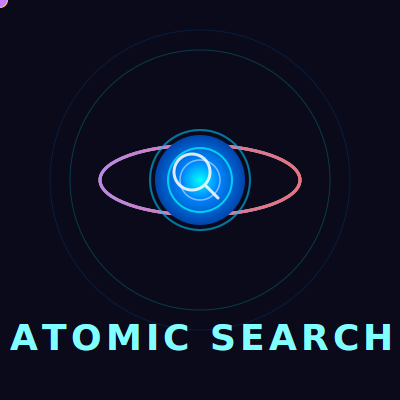

# 🔮 Atomic Search

<div align="center">



**Privacy-First Metasearch Engine | 71+ Themes | Kagi-Style UI**

*Based on SearXNG | Rebranded by UCXP Project*

[](https://www.gnu.org/licenses/agpl-3.0.en.html)
[](https://railway.app)

**[Live Demo](https://priv.au)** | **[Deploy on Railway](https://railway.app)** | **[Deploy on Render](https://render.com)**

</div>

---

## ✨ Features

### 🔐 Privacy First
- **Zero Tracking** - No logs, no cookies, no fingerprinting
- **Anonymous Proxy Routing** - Hide identity from search engines
- **Privacy Filter** - Removes tracking parameters from URLs

### 🎨 71+ Beautiful Themes
**Dark:** macchiato, mocha, nord, dracula, cyberpunk, matrix, kagi, synthwave, nebula, holographic, monokai, galaxy, flame, midnight, obsidian, royal, neon-city, steel-blue, ocean, aurora, gruvbox, hacker, terminal

**Light:** latte, frappe, light, arctic, sky, mint, sakura, lavender, rose, amber, cobalt, violet, slate, solarized, paperwhite, bubblegum, horizon, nature, coral, teal, spring, gold-rush, mint-fresh, chocolate, lavender-fields, forest-light, ocean-deep, ice, lime, nord-frost, pastel-dream

### 🏆 Kagi-Style Features
- **Domain Ranking** - Pin, boost, or block domains
- **Trust Badges** - Quality indicators on results
- **Instant Answers** - Calculator, currency conversion
- **Search Shortcuts** - `!g`, `!w`, `!gh`, `!yt`, `!r`, `!so`

### 🔑 Free API
- Zero-config API keys
- 100-10000 requests/day
- No registration required

---

## 🚀 Deploy Now

### Railway (Recommended)
```bash
# 1. Fork this repo
# 2. Go to railway.app and create new project
# 3. Connect your GitHub repo
# 4. Deploy!
```

### Render
```bash
# Use render.yaml or manual setup
```

### Docker
```bash
docker build -t atomic-search .
docker run -p 8080:8080 atomic-search
```

---

## 🔑 Search Shortcuts

| Shortcut | Engine | Example |
|----------|--------|---------|
| `!g` | Google | `!g python` |
| `!w` | Wikipedia | `!w javascript` |
| `!gh` | GitHub | `!gh react hooks` |
| `!yt` | YouTube | `!yt coding tutorial` |
| `!so` | StackOverflow | `!so async await` |
| `!r` | Reddit | `!r webdev` |
| `!hn` | Hacker News | `!hn ai news` |
| `!maps` | Maps | `!maps coffee shop` |

---

## ⌨️ Keyboard Shortcuts

| Key | Action |
|-----|--------|
| `/` | Focus search |
| `j` / `k` | Navigate results |
| `Enter` | Open result |
| `Esc` | Clear/blur |

---

## 📁 Project Structure

```
searxng-better/
├── Dockerfile           # Railway/Render ready
├── docker-compose.yml   # Local dev
├── railway.toml         # Railway config
├── render.yaml          # Render config
├── src/
│   ├── js/              # UI enhancements
│   │   ├── atomic-search.js
│   │   ├── bookmarks.js
│   │   ├── quick-settings.js
│   │   ├── search-tips.js
│   │   └── theme-toggle.js
│   ├── search/          # Search features
│   │   ├── ai_summary.py
│   │   ├── shortcuts.py
│   │   ├── translator.py
│   │   └── ...
│   └── less/themes/     # 71+ themes
└── out/                 # Built assets
```

---

## 📝 License

AGPL-3.0 - Based on SearXNG

---

<div align="center">

**Made with ❤️ for privacy**  
**Based on SearXNG | Rebranded by UCXP Project**

</div>
