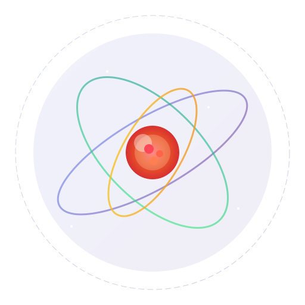

# Atomic Search 🔮

<div align="center">



**The privacy-first, feature-rich metasearch engine with 40+ stunning themes**

*Based on SearXNG* • *Rebranded by UCXP Project* • *[Live Demo](https://priv.au)*

</div>

---

## ✨ Features

### 🔐 Privacy First
- **Zero Tracking**: No cookies, no logs, no fingerprinting
- **Anonymous Proxy Routing**: Hide your identity from search engines
- **Decentralized Search**: Queries multiple engines simultaneously
- **Encrypted Connections**: HTTPS everywhere
- **No User Profiling**: Your searches stay private

### 🎨 40+ Beautiful Themes
Choose from an extensive collection of hand-crafted themes:
- **Dark Mode**: night, mocha, macchiato, dracula, nord, kagi, cyberpunk, matrix, hacker, cosmic, slate, terminal
- **Light Mode**: latte, frappe, light, arctic, sky, mint, sakura, lavender, rose, amber
- **Special**: ocean, forest, sunset, pixel, solarized, crimson, cobalt, violet
- **Catppuccin**: latte, frappe, macchiato, mocha
- **Kagi-Inspired**: kagi, brave

### 🏆 Kagi-Style UI
- **Smart Ranking**: Quality-based result prioritization
- **Domain Control**: Pin, boost, or block domains
- **Trust Indicators**: Visual badges for verified sources
- **Instant Answers**: Calculator, conversions, weather

### 🔒 Security Features
- **Scam Detection**: Built-in URL safety checking
- **Phishing Protection**: Warning indicators on suspicious sites
- **HTTPS Enforcement**: Secure connections only
- **Bot Limiting**: Optional Redis-based rate limiting

### ☁️ Cloud-Ready
- **Railway**: One-click deployment with `railway.toml`
- **Render**: Blueprint deployment with `render.yaml`
- **Docker**: Optimized multi-stage builds
- **Healthcheck**: Built-in `/healthz` endpoint

### ⚡ Performance Optimized
- **Pre-compiled Python**: Faster startup
- **Gzip/Brotli**: Compressed static assets
- **Multi-stage Build**: Smaller image size
- **Non-root User**: Enhanced security

---

## 🚀 Quick Start

### Docker (Recommended)
```bash
docker run -d --restart always -p 127.0.0.1:8080:8080 --name atomic-search ghcr.io/privau/searxng
```

### Docker Compose
```bash
# Without Redis (default)
docker-compose up -d

# With Redis for rate limiting
docker-compose --profile with-redis up -d
```

### Build from Source

1. Clone the repository:
```bash
git clone https://github.com/privau/searxng.git
cd searxng
```

2. Make changes to themes in `src/less`

3. Build static files:
```bash
./update.sh
```

4. Build Docker image:
```bash
docker build -f ./Dockerfile -t atomic-search:latest .
```

5. Run:
```bash
docker run -p 8080:8080 atomic-search:latest
```

---

## ☁️ Cloud Deployment

### Railway (Recommended)

1. Fork this repository
2. Create a new project on [Railway](https://railway.app)
3. Connect your GitHub repo
4. Deploy automatically!

```bash
# Install Railway CLI
npm i -g @railway/cli

# Login
railway login

# Deploy
railway up
```

**Environment Variables on Railway:**
- `NAME`: Your instance name
- `IMAGE_PROXY`: Set to `true` for image proxy
- `LIMITER`: Set to `true` to enable rate limiting
- `REDIS_URL`: Redis connection string (if using LIMITER)
- `SECRET_KEY`: Your secret key

### Render

1. Fork this repository
2. Create a new Web Service on [Render](https://render.com)
3. Connect your GitHub repo
4. Use `render.yaml` for automatic configuration

Or manual setup:
- **Build Command**: (empty)
- **Start Command**: `bash /usr/local/bin/run.sh`
- **Health Check Path**: `/healthz`

---

## 🌤️ New Features

### Instant Answers
Atomic Search provides instant answers to common queries:
- **Calculator**: Type `calc 2+2` or `=5*5`
- **Conversions**: Type `100 km to miles`
- **Weather**: Type `weather in London`
- **Time**: Type `time in Tokyo`

### Scam Detection
Built-in URL safety checking warns you about:
- Suspicious domains
- Phishing attempts
- Unsecured connections (HTTP)
- Known malicious sites

### Domain Ranking (Kagi-Style)
Control your search results:
- Pin favorite domains to the top
- Block unwanted domains entirely
- Boost trusted sources
- View trust scores for each result

---

## 🔧 Advanced Configuration

### Proxy Routing
Route searches through proxy servers for extra privacy:
```bash
docker run -e PROXY="socks5://proxy1:1080,socks5://proxy2:1080" ...
```

### Search Engine Selection
Default engines enabled:
- Google (default)
- Brave Search
- Wikipedia
- Wikidata
- Currency conversion

Disable unused engines with environment variables:
- `GOOGLE_DEFAULT=false`
- `BRAVE_DEFAULT=true`
- etc.

### Custom Branding
Override branding with environment variables:
- `NAME`: Instance name
- `FOOTER_MESSAGE`: Custom footer text
- `ISSUE_URL`: Issue tracker URL
- `CONTACT`: Contact page URL

---

## 🌍 Live Instances

🌐 **Global**: https://priv.au

🇺🇸 **Kansas City, US**: https://na.priv.au

🇸🇬 **Singapore**: https://as.priv.au

🇩🇪 **Frankfurt, DE**: https://eu.priv.au

🇦🇺 **Melbourne, AU**: https://au.priv.au

Use the [Looking Glass](https://lg.as44354.net/) to find the closest instance.

---

## 📁 Project Structure

```
atomic-search/
├── src/
│   ├── branding/          # UCXP branding module
│   ├── less/             # Theme LESS files
│   │   └── themes/      # Individual themes (40+)
│   ├── search/           # Search enhancements
│   │   ├── domain_ranking.py    # Kagi-style ranking
│   │   ├── instant_answers.py   # Instant answers
│   │   ├── privacy_proxy.py      # Proxy routing
│   │   ├── result_enhancer.py    # Result metadata
│   │   ├── scam_detection.py     # Scam protection
│   │   └── weather.py           # Weather search
│   ├── auth/             # API authentication
│   ├── captcha/          # Captcha support
│   ├── donation/          # Donation page
│   └── privacy-policy/   # Privacy policy
├── out/                  # Compiled static files
├── Dockerfile            # Production build
├── Dockerfile.optimized   # Optimized build
├── docker-compose.yml    # Local development
├── railway.toml          # Railway deployment
├── render.yaml           # Render deployment
└── .env.example          # Environment template
```

---

## 🤝 Contributing

Contributions welcome! Please read the existing code style and submit PRs.

---

## 📄 License

AGPL-3.0-or-later

---

## 🙏 Credits

- **SearXNG**: Core search engine functionality
- **UCXP Project**: Branding and enhancements
- **Catppuccin**: Theme inspiration
- **Kagi**: UI inspiration
- **Community**: Themes and contributions

---

<div align="center">

**Made with ❤️ for privacy-conscious users**

**Based on SearXNG | Rebranded by UCXP Project**

</div>
